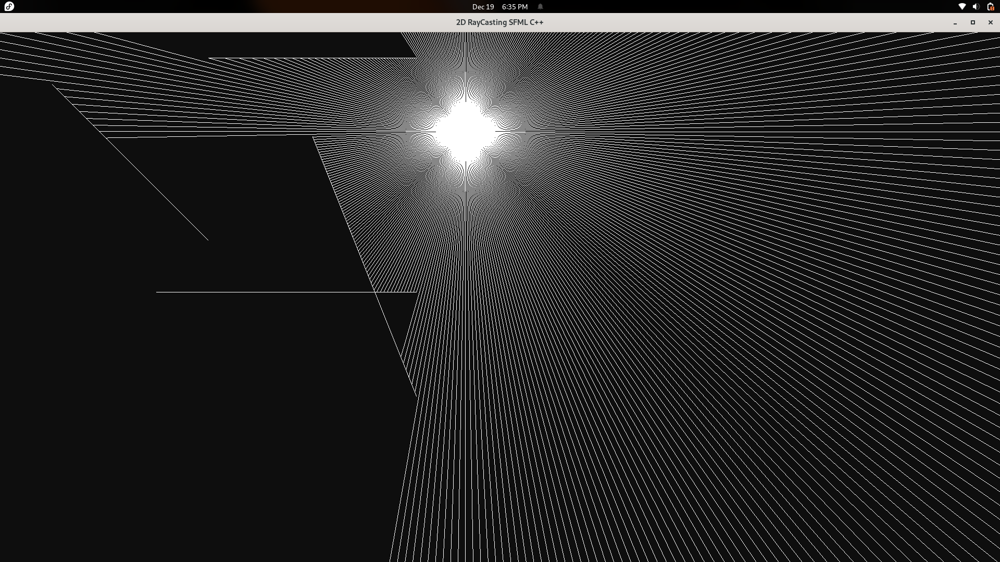

# Ray Casting Visualizer with SFML and C++



## Overview

This project demonstrates a simple Ray Casting Visualizer using SFML and C++. Ray Casting is a rendering technique that simulates the interaction of light with objects to create a 3D-like representation in a 2D space.

## Table of Contents

- [Installation](#installation)
- [Usage](#usage)

## Installation

To run this project locally, follow these steps:

1. Clone this repository:

    ```bash
    git clone https://github.com/akshat0012/2d-Ray-Casting.git
    cd 2d-Ray-Casting
    ```

2. Compile the code using your C++ compiler. Ensure that SFML libraries are linked:

    ```bash
    g++ -o ray_casting_executable rayCasting.cpp -lsfml-system -lsfml-window -lsfml-graphics
    ```

3. Run the compiled executable to launch the Ray Casting Visualizer:

    ```bash
    ./ray_casting_executable
    ```

## Usage

Just Move your mouse around and seee :):

## Acknowledgments

- [SFML](https://www.sfml-dev.org/)
- [Wikipedia - Ray Casting](https://en.wikipedia.org/wiki/Ray_casting)
